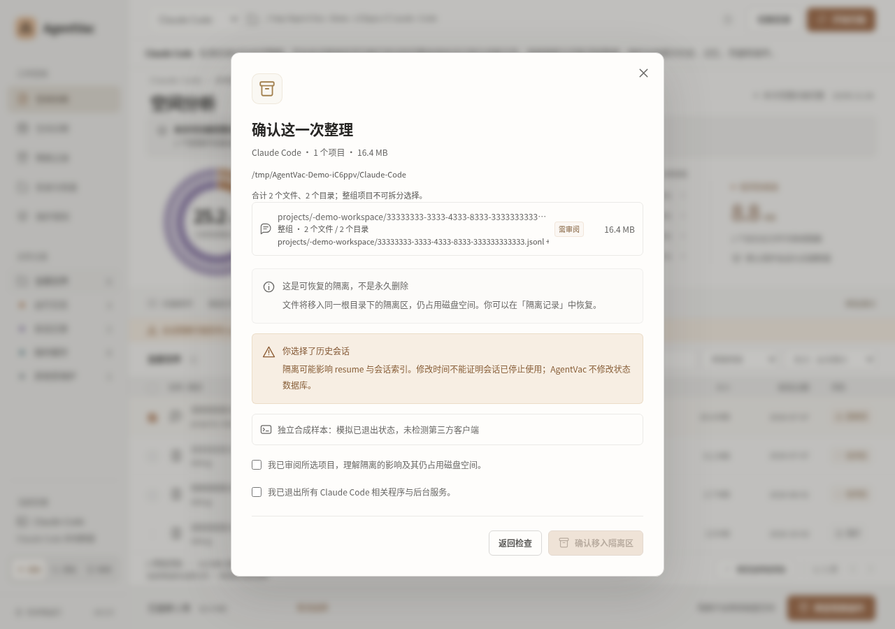
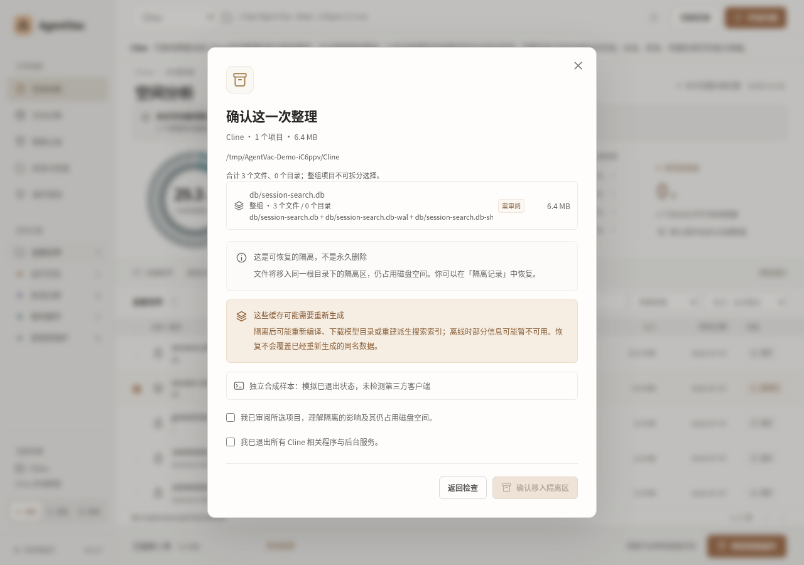
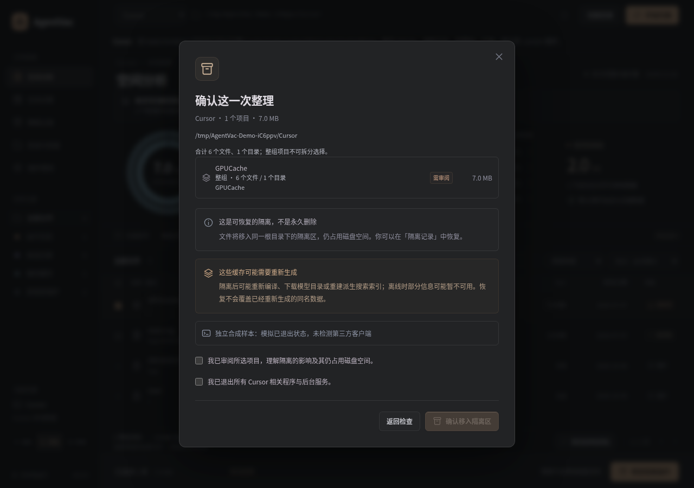

# AgentVac

[简体中文](README.md) · [English](README.en.md) · [繁體中文](README.zh-TW.md) · [日本語](README.ja.md)

Codex、Claude Code、Cline、Cursor 向けのオープンソース・デスクトップツールです。対応するローカル会話の閲覧と検索、ディスク使用量の分析、条件を満たすログ・キャッシュ・Claude Code の完全なセッション一式のプレビューを行えます。

**v0.2.0 の対応範囲：** ローカル会話の閲覧・検索と、範囲を限定した整理・復元に対応します。アーカイブや削除ができない会話があり、OS ごとの制限も残ります。Linux・macOS のパッケージと読み取り検査は下記の範囲で合格しました。Windows NSIS 版は実際のインストール、インストール済みアプリの起動・読み取り・復元、アンインストールの検査に合格しました。Windows ポータブル版は未検証のため配布対象から除外します。[リリースノート](docs/RELEASE-NOTES-0.2.0.md)と[対応範囲表](docs/RELEASE-SUPPORT-MATRIX.md)（英語）をご確認ください。

- **データの内訳を把握**：ファイルの論理サイズ、分類、整理候補、保護理由を確認できます。
- **実行前にプレビュー**：ツールとデータフォルダを選び、対象ファイルや一括で扱うデータ単位を確認します。
- **復元手段を確保**：ローカルで隔離し、バッチごとの履歴を残します。復元時は既存データを上書きしません。
- **使いやすい画面**：ライト、ダーク、システム連動のテーマに対応。Codex の SQLite とログには読み取り専用の診断も用意しています。

この README は 4 言語で提供しています。**アプリの画面は現在、簡体字中国語のみです。** AgentVac は独立したプロジェクトであり、対応ツールの開発元による公式製品ではありません。

## v0.2.0 の対応範囲

次の表はソースで確認対象になり得る範囲です。すべての OS で配布版の検証が完了したという意味ではなく、下記の OS 別制限も適用されます。

| ツール          | 確認して隔離できる対象                                                                                                                                               | 保護対象と主な制限                                                                                                                   |
| --------------- | -------------------------------------------------------------------------------------------------------------------------------------------------------------------- | ------------------------------------------------------------------------------------------------------------------------------------ |
| **Codex**       | 古いローテーション済みログ。旧形式の識別情報と復元の検査に通る既存の署名済みセッション隔離記録は復元可能                                                             | セッション JSONL の新規隔離は停止を維持。現在のログ、認証情報、設定、インデックス、データベース、不明なデータは保護                  |
| **Claude Code** | 標準の古いデバッグログ。任意で、メイン記録と認識済みの関連ファイルをまとめたローカルセッションのアーカイブ                                                           | 最新・使用中のセッション、全体のプロンプト履歴、メモリ、認証情報、不明な構成。Desktop、Cowork、クラウドの履歴整理には非対応          |
| **Cline**       | 再生成可能な全文検索キャッシュとチェックポイント用の一時キャッシュ（checkpoint scratch）。認識済みの旧版モデルカタログと保護期間を過ぎたセッション別 hook テレメトリ | 会話の本体データベース、タスク履歴、実際の Git チェックポイント、認証情報、設定。タスク全体のアーカイブには未対応                    |
| **Cursor**      | 認識済みの古い診断ログ。検証済み構成の `Cache`、`Code Cache`、`GPUCache`、`CachedData` ディレクトリ全体                                                              | チャット・状態データベース、プロファイル、拡張機能、ワークスペース、インデックス、アカウント・ネットワーク状態、不明なキャッシュ構成 |

明示的に対応したパスと、完全に認識できる構成だけが候補になります。経過日数、使用状況、ファイルシステム、プロセスの検査も必要です。フォルダが見つかっても、その中身をすべて整理できるわけではありません。Claude Code のアーカイブ済みセッションは復元するまで再開できず、全体のプロンプト履歴は変更しません。Cline では再生成中に検索やオフラインのモデル一覧が一時的に使えなくなる場合があります。Cursor では次回起動時にリソースの再ダウンロードやキャッシュの再コンパイルが必要になる場合があります。復元時に再生成済みのデータを上書きすることはありません。

詳細は [Claude Code](docs/CLAUDE-CODE-SCOPE.md)、[Cline](docs/CLINE-SCOPE.md)、[Cursor](docs/CURSOR-SCOPE.md)、[整理単位と復元](docs/SAFE-CLEANUP-UNITS.md)、[検証状況](docs/MULTI-AGENT-ACCEPTANCE.md)をご覧ください。合成データによるテストは、すべてのインストール済みツールのバージョンとの互換性や、最終配布版の全 OS での検証完了を示すものではありません。

## ローカル会話の閲覧と検索

内容の読み取りを個別に許可した後、対応する Codex JSONL、Claude Code の主会話と制限範囲内のサブエージェント内容、現行 Cline SDK と対応する旧形式の履歴、Cursor の対応データベース記録（Windows では無効）または明示的に選んだ agent-transcripts をローカルで読めます。タイトル、プロジェクト、本文キーワード、元の会話時刻で絞り込み、長いメッセージを分割表示できます。欠けている時刻は不明のままとし、ファイル更新時刻で代用しません。不明な形式、継承・圧縮された履歴、安全上の上限により結果が一部に限られる場合は、その制限を画面に表示します。

内容への許可は現在のツール、フォルダ、アプリの実行セッションに限定されます。取り消すと読み取りを停止し、表示内容を消去します。会話は単なるテキストとして表示し、命令の実行や外部メディアの自動読み込みはしません。Cline SDK フォルダと Cursor agent-transcripts は独立した読み取り専用の参照元として選べますが、整理の許可にはなりません。隔離プレビューの対象は、条件を満たし全体を識別できた Claude Code のローカルセッション一式だけです。Codex、Cline、Cursor の正式な会話の削除・アーカイブは無効のままです。

macOS と Linux での Cursor データベース読み取りには非公開のローカル一時コピーが必要です。未検索の設定・認証関連ページを含む場合があり、1 リクエストの既定の累計上限は 512 MiB です。保存場所や権限を確認できない場合は読み取らず、無断で別のコピー先に切り替えることもありません。macOS と Linux では生成データを使ったソースのネイティブ検査と配布パッケージの読み取り検査に合格していますが、すべてのインストール済みツールのバージョンとの完全な互換性を示すものではありません。v0.2.0 では Windows の Cursor IDE データベース読み取りを明示的に無効にしています。[詳細な範囲・プライバシー・制限](docs/CONVERSATION-MANAGEMENT.md)。

### OS 別の検証結果と残る制限

- **すべての OS：** 対象ツールと関連するすべての CLI、デスクトップ、IDE、SDK、バックグラウンドプロセスを終了する必要があります。実行中、観察が不完全、または状態不明の場合は、隔離・復元・OS のごみ箱への移動を止めます。拒否やスキップは整理成功ではありません。
- **Windows x64：** Cursor IDE データベースの読み取りは無効です。明示的に選んだ agent-transcripts が読み取り専用の代替手段です。ソースのネイティブデスクトップ、ごみ箱、永続性、対応する読み取り検査は合格しました。Claude Code、Cline、Cursor の変更操作は不明なプロセスにより拒否され、ファイルのバイト列は保持されました。別の NSIS 検査では実際のユーザー単位のインストール、インストール済みアプリの起動・読み取り、生成データの復元・再起動、内容の厳密な一致確認、アンインストールに合格しました。ポータブル版のネイティブ接続検査は失敗し、原因は未確定のため配布対象から除外します。
- **Linux x64：** ソースとパッケージの読み取り、tar.gz パッケージの検査は合格しました。Claude Code、Cline、Cursor の変更操作は不明なランタイムにより拒否され、バイト列は保持されました。隔離・復元の成功を確認した結果ではありません。
- **macOS Intel：** ソースのネイティブ読み取り、3 ツールの隔離・復元ライフサイクル、実際の ZIP・DMG パッケージの検査は合格しました。
- **macOS Apple Silicon：** 読み取り、3 ツールのライフサイクル、ZIP・DMG の検査は合格しました。別の実ディレクトリ経路による重複隔離・復元検査は、プロセス一覧が不完全だったため変更前にスキップされました。ネイティブごみ箱検査には生成したデモデータを使いました。

これらの検査には使い捨ての生成データを使用しました。検査対象のアプリケーションソースは `4a523b95c1098eeb3e220cc58d290819ef97a01f` です。対応範囲表では、その結果と後続の QA 専用実行を区別しています。セットアップ専用の実行 `37541701609` は合格しましたが、以前のソース検査のプロセス保護による失敗やスキップは再実行も変更もしていません。検証済みファイルは計 14 個です。通常の初回起動時の OS による信頼性確認と、OS のごみ箱 UI からの復元は未テストです。

**v0.1.0 の安全上の注意：** セッション隔離を有効にせず、古いログのみを整理してください。現在の Codex のページ化履歴は他の記録を参照する場合があります。新しいソースでは新規セッション隔離を停止しています。既存の署名済み記録も、旧形式の識別情報と復元の検査に通る場合にのみ復元できます。

## ダウンロードとインストール

OS とプロセッサーに合うパッケージを選んでください。Windows はユーザー単位の NSIS セットアップ版で、ポータブル版は配布対象外です。ビルド済みアプリには Node.js の別途インストールは不要です。

| プラットフォーム | ダウンロード | チェックサム | 動作対象 |
| --- | --- | --- | --- |
| macOS · Apple Silicon | [AgentVac-0.2.0-macos-arm64.dmg](https://github.com/21888/AgentVac/releases/download/v0.2.0/AgentVac-0.2.0-macos-arm64.dmg) | [SHA-256](https://github.com/21888/AgentVac/releases/download/v0.2.0/AgentVac-0.2.0-macos-arm64-SHA256SUMS.txt) | macOS 13 以降、M シリーズチップ |
| macOS · Intel | [AgentVac-0.2.0-macos-x64.dmg](https://github.com/21888/AgentVac/releases/download/v0.2.0/AgentVac-0.2.0-macos-x64.dmg) | [SHA-256](https://github.com/21888/AgentVac/releases/download/v0.2.0/AgentVac-0.2.0-macos-x64-SHA256SUMS.txt) | macOS 13 以降、Intel プロセッサー |
| Windows | [AgentVac-0.2.0-windows-x64-setup.exe](https://github.com/21888/AgentVac/releases/download/v0.2.0/AgentVac-0.2.0-windows-x64-setup.exe) | [SHA-256](https://github.com/21888/AgentVac/releases/download/v0.2.0/AgentVac-0.2.0-windows-x64-SHA256SUMS.txt) | Windows 10 以降、x64。ユーザー単位の NSIS インストーラー |
| Linux | [AgentVac-0.2.0-linux-x64.tar.gz](https://github.com/21888/AgentVac/releases/download/v0.2.0/AgentVac-0.2.0-linux-x64.tar.gz) | [SHA-256](https://github.com/21888/AgentVac/releases/download/v0.2.0/AgentVac-0.2.0-linux-x64-SHA256SUMS.txt) | サポート中の Linux x64 デスクトップ |

macOS の ZIP 版と OS 別の検証結果は [v0.2.0 リリースページ](https://github.com/21888/AgentVac/releases/tag/v0.2.0)に掲載する構成です。ダウンロードしたファイルは対象 OS のチェックサムで確認してください。検証済みの構成は計 14 ファイルで、Linux・macOS の 11 ファイルに Windows セットアップ EXE、チェックサム、検証結果を加えています。リポジトリが非公開の場合はアクセス権のある GitHub アカウントが必要です。セキュリティ更新が提供されている OS を使用してください。

- **macOS**：プロセッサーに合う DMG を開き、AgentVac を「アプリケーション」フォルダにドラッグして、そこから起動します。
- **Windows**：setup EXE を実行してユーザー単位でインストールし、インストール済みアプリを起動します。削除する際は、インストール済みのアンインストーラーを使ってください。
- **Linux**：tar.gz をすべて展開し、通常のデスクトップセッションで中のアプリを実行します。依存パッケージはディストリビューションの正式なパッケージマネージャーでインストールしてください。ごみ箱への移動には、動作するデスクトップの Trash バックエンドが必要です。利用できない場合、操作は失敗し、ファイルは保持されます。AppImage は提供していません。

**macOS 版は Developer ID 署名と Apple の公証が未完了で、Windows 版は Authenticode 署名が未完了です。** Gatekeeper や SmartScreen が警告を表示したり、起動を止めたりする場合があります。警告を回避するために OS の保護機能、Chromium sandbox、AppArmor を無効にしないでください。通常の初回起動時の OS による信頼性確認は未テストで、パッケージ検査の合格では代替できません。まずはデモデータでお試しください。

## スクリーンショット

以下は、**v0.2.0 の画面を合成テストデータで撮影したもの**です。プレビュー内のプロセス検査はシミュレーションです。グラフは検出したファイルの論理サイズを示しており、ユーザーの実際の使用量や解放可能な容量ではありません。画面の紹介を目的としており、インストール済みツールとの互換性、各 OS のネイティブ動作、署名、初回起動時の OS による信頼性確認の検証完了を示すものではありません。

### 容量分析 · ライト

ツールを選び、ファイルの分布、分類一覧、保護理由を確認します。


### 容量分析 · ダーク

整理候補の古いログと、初期設定で保護されるセッションを区別して表示します。


### 容量診断

Codex の対象範囲を選択し、SQLite 関連ファイルと通常のログを読み取り専用で確認します。


### 隔離履歴と復元

Claude Code のバッチ履歴には、隔離中のデバッグログと、全体を復元済みのローカルセッションのアーカイブを表示しています。


<details>
<summary>その他のプレビュー：Claude Code、Cline、Cursor</summary>

### Claude Code · セッション全体のアーカイブ

メイン記録と認識済みのサブエージェントのファイルをまとめて確認してから、一式を隔離します。



### Cline · 再生成可能な検索キャッシュ

派生検索キャッシュのデータベースと、存在する WAL / SHM 関連ファイルを一つのまとまりとして扱います。会話の本体データベースは保護します。



### Cursor · キャッシュディレクトリ全体

認識済みの GPUCache ディレクトリ全体を確認し、後でキャッシュの再生成が必要になる可能性を表示します。



</details>

## はじめて使うとき

以下では、現在の画面に表示される中国語のラベルに日本語の説明を添えています。

1. **まずデモを試す。** 「体验演示扫描」（デモスキャンを試す）をクリックし、独立した Codex デモ用ワークスペースでプレビュー、隔離、復元を練習します。前回の操作状態は保存されます。
2. **ツールとデータフォルダを選ぶ。** v0.2.0 では画面上部で Codex、Claude Code、Cline、Cursor を選び、OS 標準のフォルダ選択画面で接続します。v0.1.0 は Codex のみ対応し、通常の場所は `~/.codex` または `CODEX_HOME` で指定したパスです。対象ツールのデータルートを選び、プロジェクトフォルダやディスクのルートは選ばないでください。Cursor IDE のデータフォルダは `.cursor` とは別です。候補パスは参考情報であり、自動スキャンはしません。
3. **ファイルと復元キーをバックアップする。** データをバックアップしてから、「目录与恢复」（フォルダと復元）で「导出恢复备份」（復元用バックアップのエクスポート）を選びます。機密性の高いキー情報を含むため、オフラインで安全に保管し、アップロードや共有はしないでください。キーのバックアップはファイルのバックアップの代わりにはなりません。
4. **スキャンしてプレビューを確認する。** 初期設定では直近 **30 日間**のファイルを保護します。まずは条件を満たす古いログを少数選び、保護理由、スキャンの完了状態、選択したセッションやキャッシュの全構成要素を確認します。実データの操作前には、対象ツールと関連するすべての CLI、デスクトップ、IDE、SDK、バックグラウンドのプロセスを終了し、アプリ内で確認してください。実行中または状態不明のプロセスがあると操作を止めます。
5. **復元を試す。** 「隔离记录」（隔離履歴）から直前のバッチを復元します。既存ファイルやディレクトリへの上書き・統合は行いません。競合、データの変更、親フォルダの欠落がある場合は対象を保持します。問題を解消し、対象ツールを終了したまま再試行してください。
6. **ごみ箱への移動は最後に。** 不要だと確認できたバッチだけを OS のごみ箱へ移動します。システム API が失敗した場合はファイルを保持し、代わりに完全削除することはありません。

Codex の SQLite やログが別のフォルダにある場合は、「空间诊断」（容量診断）で場所を追加して対象を選び、「只读统计」（読み取り専用の集計）を実行できます。設定内のパス情報は、設定の読み取りを明示的に有効にした場合のみ解析し、そのパスに自動でアクセスすることはありません。他のツールは、上記の各対応範囲でメタデータをスキャンします。

## 安全性と保護対象

**隔離してもディスクの空き容量は増えません。** ファイルはまず、選択したフォルダ内の `.agentvac-quarantine` に移動します。OS のごみ箱に移した後も、通常はディスク領域を使用します。空き容量が増える可能性があるのは、ユーザーが OS 上でごみ箱を空にした後です。この削除は取り消せません。AgentVac 自体には完全削除機能がありません。

- **対象を明確に限定**：Codex の既存の古いログの判定は維持しています。Codex セッションの新規隔離は停止し、既存の署名済み記録も識別情報と復元の検査に通る場合にのみ復元します。対応する Claude Code セッション全体の隔離には、引き続き明示的な確認が必要で、再開には復元が必要です。
- **重要なデータを保護**：認証情報、設定、本体のデータベースと関連ファイル、プロジェクトデータ、不明な構成は保護します。データベース型キャッシュの例外は、Cline の認識済みの派生検索キャッシュとその関連ファイルだけです。SQL は実行せず、内容を解析しない一つのまとまりとして移動します。
- **まとまり全体で扱う**：対応するセッションの関連ファイルやキャッシュディレクトリを分割して選ぶことはできません。不明な構成要素、不完全なスキャン、構成変更があれば全体を保護します。1 単位の上限は 5,000 ノード、子ディレクトリ 12 階層です。
- **リンクをたどらない**：シンボリックリンク、複数のハードリンクを持つファイル、特殊ファイル、別ボリュームの構成要素、保護期間内のファイルは隔離できません。
- **慎重に実行**：プレビューは短時間のみ有効で、使用は 1 回限りです。実行前に再検証します。関連プロセスは終了したままにしてください。検査に失敗した場合や状態が不明な場合は変更を止めます。SQL による整理、VACUUM、checkpoint、データベースのモード変更は行いません。Codex のログデータベースの詳細な読み取り専用検査には、別途厳しい前提条件があります。

スキャンの上限は初期設定で **50,000 項目**、設定により 100,000 項目までです。項目数にはディレクトリも含まれ、深さ 12、結果データ 24 MiB の制限も適用されます。不完全なスキャンは明示し、一括選択を無効にします。1 バッチは最大 5,000 項目です。グラフと小計は検出した通常ファイルの論理サイズだけを示し、ディレクトリ全体の使用量や解放可能な容量は示しません。

復元時にはファイルのスナップショットも照合します。マニフェストのキー認証が成功しても、ファイル本文をバイト単位やハッシュで検証したことにはなりません。別ボリュームへのコピー、別のコンピューターへの移行、OS のごみ箱からの復元によってファイルの識別情報が変わると、自動復元が拒否される場合があります。バッチ全体と元のキーのバックアップを保管し、検証を回避するためにマニフェストを書き換えないでください。ごみ箱から戻す場合は、まず OS の機能でバッチフォルダ全体を元の `.agentvac-quarantine/<バッチID>` に戻し、その後 AgentVac で検証して元の場所へ復元します。

ディレクトリ全体の復元では、OS 固有の ACL、拡張属性、作成時刻の完全な保持は保証しません。新規バッチの複数の構成要素は署名付き v4 復元記録で管理し、一度の原子的な名前変更として扱うものではありません。Windows ではディレクトリの fsync を保証できません。古いマニフェストで安全でない丸めが発生した識別値はキーの再インポートで修復できないため、無理に復元せずバッチ全体を保管してください。OS のごみ箱 UI からの復元は未テストです。

## プライバシーと利用上の制限

通常のスキャンではファイルのメタデータのみを読み取り、ログやセッションの本文は読みません。ユーザーのファイルをアップロードすることもありません。別途許可した会話の閲覧と本文検索ではローカルの内容を読みます。明示的に有効にした設定パスの解析、読み取り専用のデータベース構造・ページ状態の検査、アプリ自身の復元キーとマニフェストの読み取りは、それぞれ制限された別の処理です。AgentVac はこれらのツールの起動や更新を行いません。

Renderer に Node へのアクセス権はなく、sandbox、context isolation、CSP を有効にしています。プレビューは短時間のみ有効で、使用は 1 回限りです。実行直前に再検証し、隔離は同じボリューム内での移動、復元は既存ファイルを上書きしない方式で行います。

管理者権限での実行、信頼できないユーザーが書き込めるフォルダでの使用、対象ツールやそのバックグラウンドサービスを実行したままでの整理は避けてください。パスを繰り返し確認しても、悪意ある競合操作をすべて防ぐことや、停電・ディスク障害時のデータ整合性を保証することはできません。重要なデータは別途バックアップしてください。

## ソースコードからの実行とビルド

Electron、Vue 3、TypeScript を使用しています。Node.js `^22.17.0` または `>=24.0.0` と通常のデスクトップセッションが必要です。現在の `package-lock.json` は Electron `44.5.1` に固定しています。`npm ci` でロック済みの依存関係をインストールしてください。

```sh
npm ci
npm run dev

# 本番用にビルドして起動
npm run build
npm start
```

検査コマンド：

```sh
npm test
npm run typecheck
npm run build
npm run test:e2e
npm run test:app-data
npm run test:ux
npm run test:bulk
npm run test:scan
npm run test:accessibility
npm run test:desktop
npm run test:providers
```

デスクトップの検査には、対象 OS の GUI とネイティブサービスが必要です。テストは生成したデータを使い、ユーザーの実データはスキャンしません。ブラウザーや補助プロセスのテストは、最終配布ファイルのネイティブ検証を代替するものではありません。

```sh
npm run dist:mac    # macOS arm64 / x64：DMG、ZIP のビルド対象
npm run dist:win    # Windows x64：NSIS、portable EXE のビルド対象
npm run dist:linux  # Linux x64：tar.gz のみ
npm run pack       # 現在のプラットフォーム向けの未アーカイブのアプリフォルダ
```

上記はビルド対象です。実際の配布ファイルはダウンロード欄をご確認ください。GitHub Actions のネイティブ検証は通常、必要に応じて手動で実行します。特定のソース検証のために一時的な起動条件を設定する場合があるため、正確な条件は現在のワークフローファイルをご確認ください。検証によって Release が自動公開されることはありません。

`SOURCE-SHA256.json` は、特定のソーススナップショットに含まれるコード、テスト、文書、スクリーンショットのハッシュを記録します。リリース検証の完了や配布バイナリの検証を示すものではありません。v0.2.0 には対象 OS・アーキテクチャ別のチェックサムファイルを使い、v0.1.0 には既存の `SHA256SUMS.txt` を使ってください。

## ライセンス

[MIT License](LICENSE)。サードパーティーのライセンスは [THIRD-PARTY-NOTICES.txt](THIRD-PARTY-NOTICES.txt) を参照してください。配布アプリには Electron / Chromium などのライセンス表記を同梱しています。
