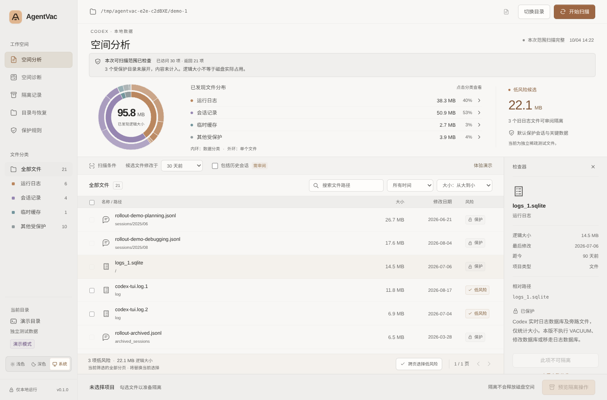
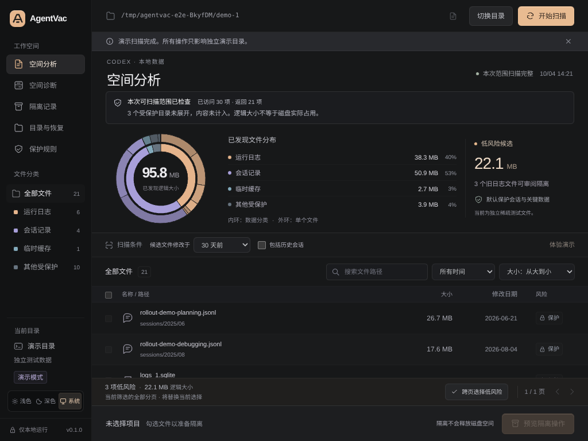
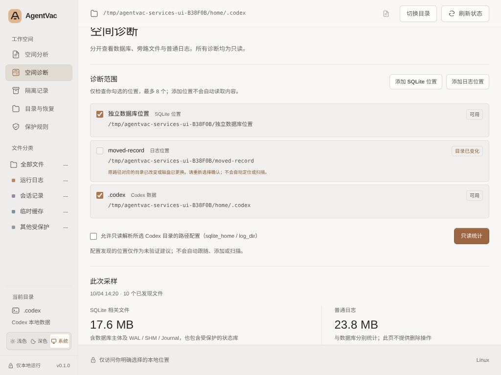
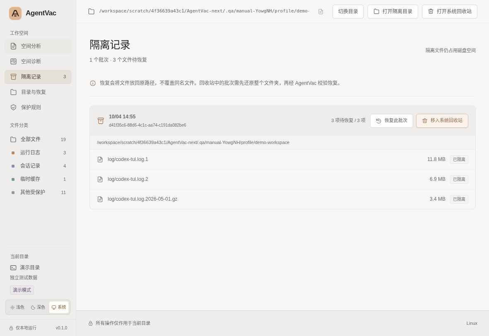

# AgentVac

一个保守整理 Codex 本地数据的中文桌面应用：先看清空间分布，再预览、隔离旧文件，必要时恢复原位。基于 Electron + Vue 3 + TypeScript。

- **看清占用**：可视化文件分布，区分日志、会话与受保护数据。
- **只读诊断**：分开统计 SQLite、旁路文件和普通日志。
- **可回看、可恢复**：隔离前预览，按批次查看记录并校验恢复。
- **浅色 / 深色主题**：支持手动切换与跟随系统。

## 界面预览

以下是应用真实界面的测试截图，全部使用**合成测试夹具**，不是用户的实际 Codex 数据。图中大小是夹具的逻辑大小，不是实际磁盘占用、可释放空间或性能承诺；截图也不代表 macOS / Windows 原生验收已通过。

### 空间分析 · 浅色

环形图、文件分类与逐项检查器，帮助先看清文件分布和保护原因。



### 空间分析 · 深色

同样的扫描工作台支持深色主题；旧日志候选与默认受保护的会话分别标识。



### 空间诊断

明确勾选检查位置，分开查看 SQLite 相关文件与普通日志的统计结果。此页不提供数据库清理或删除操作。



### 隔离记录与恢复

按批次查看已隔离文件，恢复前重新校验，已有同名文件不会被覆盖。下图来自 Linux 原生测试中的演示批次，三个文件处于待恢复状态。



## 当前版本与安全边界

当前是新增功能验证版 `AgentVac-next`；包内版本号仍为 `0.1.0`，不是已完成三平台签名与原生验收的正式发行版。

**隔离不等于释放磁盘。** 文件先进入所选目录内的 `.agentvac-quarantine`。移入系统回收站后通常仍占用磁盘，需用户在操作系统中清空才可能释放；清空后不可恢复。AgentVac 不提供永久删除功能。

本私有仓库保存源码、测试、构建所需图标、文字验证证据及上方四张界面截图。本次文档更新不启动 GitHub Actions。截图来源、仓库范围和待运行条件见 [仓库范围说明](docs/REPOSITORY-CONTENTS.md)。

## 这一版能做什么

- **空间分析**：受限目录扫描、进度与取消、明确的不完整结果；默认访问 50,000 项，可主动改为 100,000 项，另有 24 MiB 结果预算。
- **空间诊断**：分别统计 SQLite 主体、WAL / SHM / Journal 与普通日志；支持明确选择的独立 SQLite、日志目录。可对已识别结构的 `logs_2.sqlite` 做只读页状态检查。
- **目录与恢复**：保留最多 12 个最近位置；恢复钥匙的主动导出、导入与公开 ID；缺钥匙时仍可只读核实隔离区留存情况。
- **固定演示工作区**：每份应用配置只使用一个 `userData/demo-workspace`，重启和再次载入保留原有演示操作。

**本版不压缩、不删除、不清理日志数据库，不执行 VACUUM、checkpoint 或模式转换，不启动或升级 Codex。** 状态数据库、配置、凭据等仍始终保护。详细流程与边界见 [新增功能使用说明](docs/NEXT-FEATURES.md)。

## 安装与运行要求

构建目标为 macOS 13+（Apple Silicon / Intel）、Windows 10+ x64、主流受支持 Linux x64 桌面；请使用仍有安全更新的系统。未制作 Windows ARM、32 位 Windows 或 Linux ARM 发行包。预构建应用不需要另装 Node.js。

- **macOS**：使用匹配处理器架构的应用，完整解压后放入 Applications。当前未完成 Developer ID 签名与 Apple 公证；Gatekeeper 可能阻止打开。不要关闭系统防护或绕过安全警告。
- **Windows**：构建目标包括 NSIS 安装器与便携 EXE。当前未完成 Authenticode 签名；SmartScreen 可能阻止打开。核实来源和校验和，不要关闭系统防护。
- **Linux**：AppImage 需要桌面会话、对应运行库与可用的 FUSE 条件。系统回收站还依赖桌面环境提供可工作的原生 Trash 工具/后端；缺失时会报错并保留文件。通过发行版正规包管理器处理依赖，不要禁用 Chromium sandbox、AppArmor 或其他安全策略。参阅 [AppImage 官方 FUSE 说明](https://docs.appimage.org/user-guide/troubleshooting/fuse.html)。

安装包存在、归档完整或 CI 构建成功，都不等于目标设备已验收。当前平台验证情况见下方「检查与验收」。

从源码运行需要 Node.js `^22.17.0` 或 `>=24.0.0`：

```sh
npm ci
npm run dev
# 或构建后启动
npm run build
npm start
```

## 第一次使用：从定位到恢复

1. **先体验演示。** 点击「体验演示扫描」，练习预览、隔离与恢复。演示为合成稀疏文件，显示逻辑大小，与真实 Codex 数据无关。
2. **连接实际数据目录。** 在原生文件夹对话框中选择 Codex 数据根目录，通常为用户主目录下的 `.codex`，也可能由 `CODEX_HOME` 自定义。不要选择项目目录或磁盘根目录。界面的建议路径只是未验证候选；应用不会因此扫描主目录。已选路径缺失或身份改变时需手动重新选择。
3. **先备份。** 保留数据备份，在「目录与恢复」主动「导出恢复备份」到安全的新文件。备份含敏感钥匙材料，请离线妥善保管，不要上传或发给别人。钥匙不能替代文件备份。
4. **确认实际占用来自哪里。** 若数据库或日志放在别处，在「空间诊断」添加 SQLite / 普通日志目录，勾选范围后「只读统计」。最多一次 8 个已选位置。只有主动勾选配置读取，才解析所选 Codex 目录的 `sqlite_home` / `log_dir` 路径提示；提示不会自动被访问。
5. **扫描并小批量试用。** 在「空间分析」选保护天数后扫描。先只选少量足够旧的轮转日志。检查覆盖状态、逐项理由与预览；真实隔离前退出全部 Codex CLI / 桌面进程并明确确认。旧会话不等于非活跃会话，移走 JSONL 可能影响 resume / 历史。
6. **验证恢复。** 在「隔离记录」恢复刚才的批次。已有目标文件绝不覆盖；发生冲突、文件变化或父目录缺失时保留失败项，按提示处理后重试。
7. **钥匙或记录有问题时先只读核实。** 在「目录与恢复」读取留存情况，再导入你自己的原钥匙备份并重新检查。导入会清空旧扫描与选择；不表示批次已经认证，更不表示已完成数据完整性验证。
8. **最后才考虑系统回收站。** 确认批次不再需要，勾选说明并输入「回收站」。系统 API 失败时不会改用永久删除。需要还原时先通过操作系统把整个批次文件夹恢复到原 `.agentvac-quarantine/<批次ID>`，再由 AgentVac 校验并恢复原路径。

## 统计与操作边界

### 扫描覆盖

- 默认 50,000 / 可选 100,000 个访问条目，**包括目录**；最大递归深度 12，结果预算 24 MiB。提高条目上限不取消其余限制。
- 达上限、存在无权限条目或达到深度限制时显示 `partial` /「扫描不完整」。表头、跨页等批量选择停用；仍可逐项选择已发现的合格文件，预览再次说明未检查部分。
- 完整扫描也不会展开受保护或未知目录。图表与小计是**已发现普通文件的逻辑大小**，不是整个 Codex 目录的总占用，也不是实际分配空间或预计可释放空间。
- 每批最多 5,000 项，不静默截断；筛选或翻页不会偷偷取消已有选择，改变扫描条件则要求重新扫描。

### 保护规则

| 内容                                                        | 处理方式                                 |
| ----------------------------------------------------------- | ---------------------------------------- |
| 足够旧的 `log/codex-tui.log.数字`、日期轮转版本，可带 `.gz` | 单链接普通文件才可隔离                   |
| 当前 `log/codex-tui.log`                                    | 始终保护                                 |
| `sessions/**/*.jsonl`、`archived_sessions/**/*.jsonl`       | 默认保护；主动开启会话复核后才可选合格项 |
| 缓存、凭据、配置、history、索引、state、SQLite 与旁路文件   | 不可隔离                                 |
| Skills、MCP、项目、未知目录及其他未知文件                   | 保护，不递归未知目录                     |
| 符号链接、多重硬链接、特殊文件、保护天数内文件              | 保护，不跟随链接                         |

SQLite 相关总量**包含受保护状态库**，不表示这些文件可以清理。只读深查还要求：主动开启、确认全部退出、检查前后进程状态均为 `clear`、无 WAL / SHM / Journal、文件身份稳定且结构为支持的 `logs_2.sqlite`。数据库解析在独立进程中执行，默认时限 5 秒，可取消；退出应用会终止所属检查进程。无法满足条件时拒绝深查，不降级成可能写入的打开方式。

数据库页数、空闲页、`auto_vacuum`、`journal_mode` 只是观察值，不是可释放量承诺。磁盘可用空间采样会受其他程序影响；同一磁盘的多个位置不要重复相加。详见 [只读诊断边界](docs/NEXT-FEATURES.md#只读诊断与深入检查)。

## 演示、钥匙与恢复

- 演示路径固定在当前 Electron `userData/demo-workspace`，不再每次在临时目录新建。再次打开会复用文件、隔离记录与恢复状态，不补回已经移走的演示文件。
- 重置需再次确认，只在目录归属认证和有界清点通过后，将**整份旧演示**移入系统回收站再创建新演示。已知模板文件上的修改也随旧演示一起移动。未知新增文件/目录、链接或无法认证的记录会阻断重置，先由用户移出或另存额外资料；失败不覆盖旧数据。
- 演示初始化中断会显示「准备中」或需要检查，不盲目再生成。具有精确名称且签名有效的完成标记临时文件可用于确认中断归属；无法认证的内容仍保留。
- 每批隔离清单以 HMAC 认证，钥匙保存在本机 `userData/recovery/`。导出备份支持在重装或迁移后补回可信原钥匙；导入不覆盖现有钥匙，也不自动更改清单的原根路径或文件身份要求。
- 主钥匙不可用时不创建新隔离或执行批次 Trash；仍可扫描、只读核实，且已有可信原钥匙可用于恢复符合校验条件的批次。原钥匙遗失后出现的新钥匙不能认证旧批次。
- 「清单已认证」只表示清单通过了可信钥匙检查，**不表示隔离数据正文已逐字或哈希核验**。恢复和普通批次 Trash 还会核对保存的文件身份/大小/时间等快照。演示重置的名单核验也不是正文完整性鉴定。
- 跨设备、跨卷复制、根路径变化或 OS 回收站还原可能改变身份信息，即使钥匙正确也可能拒绝自动恢复。保留整个批次与备份，不要手改签名清单强行绕过保护。

## 安全设计及限制

Renderer 无 Node 权限，启用 `contextIsolation`、sandbox 与 CSP；固定 preload API、顶层窗口 IPC 来源校验，并拒绝导航、弹窗及浏览器权限。一般扫描不读取用户文件正文；明确开启的路径配置解析、只读数据库结构/页检查，以及应用自身钥匙与恢复清单读取是单独的受限流程，不返回日志行或凭据内容。

预览有效期 5 分钟、单次使用，执行前重新校验源文件、路径与进程。隔离使用同卷 rename，不回退到跨卷 copy/delete；恢复原子创建硬链接且不覆盖目标，不支持时失败并保留隔离文件。主进程限制并发操作，应用使用单实例锁。主题支持浅色、深色、跟随系统，并保留本机偏好。

Node 跨平台路径 API 不能提供内核级目录事务隔离；重复检查不能消灭检查与系统调用之间的全部恶意竞态。不要在其他不可信用户可写的目录运行，不要提权启动，也不要边运行 Codex 边整理。本项目不承诺突然断电、坏盘或恶意并发下的事务一致性；它不是通用磁盘清理器或取证擦除器。

## 检查与验收

```sh
npm test
npm run typecheck
npm run build
npm run test:e2e          # 临时夹具：真实引擎 + 浏览器测试桥
npm run test:app-data     # 目录、诊断、钥匙、持久演示的双主题 UI 状态
npm run test:ux
npm run test:bulk
npm run test:accessibility
npm run test:desktop      # 真实桌面上的 Electron 窗口/preload/IPC 测试
```

- 本次新增模块、独立诊断进程及双主题 UI 已完成分层回归；通过数、未运行项与精确范围见 [测试报告](docs/TEST-REPORT.md)，不能把局部通过当作全部验收。[双主题状态证据](docs/app-data-regression/states.json)
- **旧基线已有 Linux 原生证据**：真实 sandbox、IPC、隔离/恢复、偏好、原生目录对话框，以及标准 XDG Trash 往返与还原后哈希比对。使用真实 GIO / `trash-cli`，并非把 rename 冒充系统回收站。[旧基线原生报告](docs/native-linux-baseline/README.md)
- **新版本另有 Linux 原生证据**：source 与 tar.gz 实际程序的主流程、偏好/演示持久化、6 个目录/钥匙对话框，以及新版本标准 Trash 往返均已通过。实际运行中的 Codex 进程使原生深查/取消/关窗被安全阻止，因此这些项待无 Codex 的测试环境复验。AppImage/FUSE、图形回收站、macOS / Windows 原生、签名与公证仍未完成。详见 [新版证据](docs/native-linux-next/README.md)。
- 浏览器 UI 测试桥与 Electron 独立辅助进程测试不能替代已安装整应用的原生 IPC/权限/对话框/回收站验收。所有自动化数据操作仅使用生成夹具，不扫描真实 `.codex` 或用户会话。

## 打包与发布边界

```sh
npm run dist:mac    # macOS：arm64 / x64 DMG、ZIP
npm run dist:win    # Windows：x64 NSIS、portable EXE
npm run dist:linux  # Linux：x64 AppImage + tar.gz（无需 FUSE 的解包应用）
npm run pack       # 当前平台未归档应用目录
```

`.github/workflows/native-desktop.yml` 提供 Linux x64、Windows x64、macOS x64 / arm64 原生矩阵；仅手动触发，每项最长 20 分钟，并取消同分支重复运行。不配置自动触发、依赖缓存或构建附件上传，也不发布 Release。获准使用私有 GitHub CI 不代表已获准公开源码、发布正式版本或推广未经签名的产物。正式分发仍须完成目标平台构建、原生安装/恢复验收及相应签名与公证；工程不包含签名证书或账号凭据。

## 代码与说明

- `src/`：Vue 界面；`shared/types.ts`：IPC 契约
- `electron/main.ts` / `preload.ts`：桌面入口与固定 API
- `electron/engine.ts`：扫描、分类、隔离、签名记录和恢复
- `electron/app-services.ts`：目录、候选、诊断、钥匙与持久演示的整合
- `electron/workspaces.ts` / `recovery-keys.ts`：本机目录记录与钥匙管理
- `electron/diagnostics.ts` / `diagnostic-*.ts`：只读统计、独立解析进程与生命周期保护
- `tests/`、`scripts/`、`docs/`：夹具测试、验收脚本与证据
- [新增功能使用说明](docs/NEXT-FEATURES.md)：实际目录定位、诊断、钥匙恢复与故障处理

本项目采用 MIT License；第三方许可见 `THIRD-PARTY-NOTICES.txt`，打包保留 Electron / Chromium 等通知。项目非 OpenAI 官方产品，不上传用户文件，不自动联网发布或更新 Codex。
